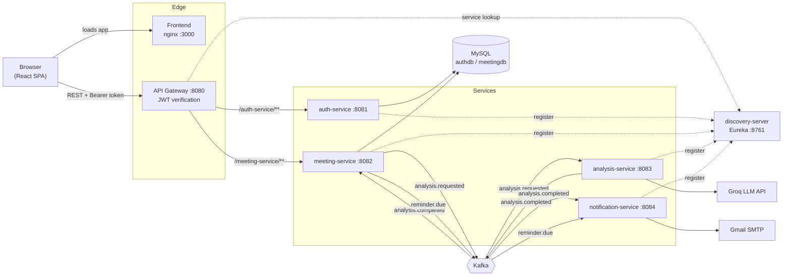
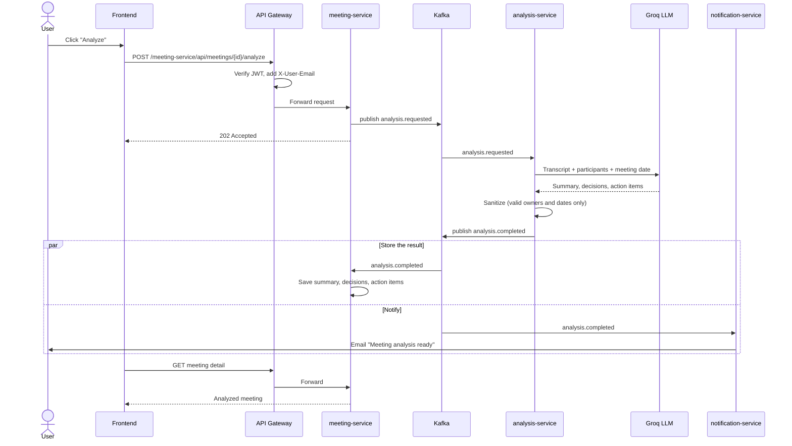

# Meeting Intelligence Platform

An event-driven microservices application that turns raw meeting transcripts into structured outcomes. Paste a transcript, and an LLM extracts a **summary**, the **decisions** made and **action items** with owners and due dates. Results are stored per meeting, and email notifications and next-day reminders are sent automatically.

Built with **Java 21, Spring Boot 4, Spring Cloud, Spring AI (Groq), Kafka, MySQL and React**, and fully containerized with **Docker Compose**.

---

## Table of contents

- [Features](#features)
- [Architecture](#architecture)
- [How a meeting gets analyzed](#how-a-meeting-gets-analyzed)
- [Services](#services)
- [Tech stack](#tech-stack)
- [Kafka topics](#kafka-topics)
- [Security model](#security-model)
- [API reference](#api-reference)
- [Project structure](#project-structure)
- [Getting started (Docker)](#getting-started-docker)
- [Configuration](#configuration)
- [Running services locally (without Docker)](#running-services-locally-without-docker)
- [Useful commands](#useful-commands)
- [Troubleshooting](#troubleshooting)
- [Design decisions](#design-decisions)

---

## Features

- **AI meeting analysis:** summary, decisions and action items extracted from a transcript using an LLM (Groq, via Spring AI).
- **Owner assignment:** action items are assigned to meeting participants by email. Owners and dates returned by the model are validated, so the model's output is never trusted blindly.
- **Relative date resolution:** phrases like "by next Friday" are resolved against the meeting date.
- **Asynchronous processing:** analysis runs through Kafka, so the API responds immediately (`202 Accepted`) and the UI doesn't wait on the LLM.
- **Email notifications:** an HTML email (Thymeleaf template) when an analysis completes or fails.
- **Reminders:** a scheduled job publishes a reminder for each pending action item due the next day, and the notification service emails the owner.
- **Authentication and authorization:** JWT-based login, with an **admin approval workflow** for new registrations.
- **Action item tracking:** mark items complete from the meeting detail page.
- **Single entry point:** every request goes through the API gateway, which verifies the JWT and injects trusted identity headers.
- **One-command deployment:** the whole stack starts with `docker compose up`.

---

## Architecture



**Key ideas**

- The browser only talks to **two** things: the nginx container (static files) and the **API gateway** (all API calls).
- The business services are **not exposed** outside the Docker network. They are reachable only through the gateway.
- Services find each other through **Eureka** service discovery, and the gateway load-balances by service name.
- **analysis-service** and **notification-service** have no REST endpoints of their own. They are driven entirely by Kafka events.

---

## How a meeting gets analyzed



---

## Services

| Service | Port | Responsibility | Storage / integrations |
|---|---|---|---|
| **frontend** | 3000 (nginx :80) | React single-page app | Calls the gateway from the browser |
| **api-gateway** | 8080 | Single entry point, JWT validation, routing, CORS | Eureka |
| **auth-service** | 8081 | Registration, login, admin approval, JWT issuing | MySQL `authdb` |
| **meeting-service** | 8082 | Meetings, participants, action items, reminders scheduler | MySQL `meetingdb`, Kafka |
| **analysis-service** | 8083 | LLM analysis of transcripts | Kafka, Groq API |
| **notification-service** | 8084 | Emails for completed analyses and reminders | Kafka, Gmail SMTP |
| **discovery-server** | 8761 | Eureka service registry and dashboard | None |
| **mysql** | 3307 (host) | Relational storage | Named volume `mysqldata` |
| **kafka** | 9092 (host) | Event backbone (KRaft mode, no ZooKeeper) | None |

---

## Tech stack

| Layer | Technology |
|---|---|
| Language / runtime | Java 21 |
| Framework | Spring Boot 4.1, Spring Cloud 2025.1 |
| Gateway | Spring Cloud Gateway (Server WebMVC) with a custom JWT filter |
| Service discovery | Netflix Eureka |
| Messaging | Apache Kafka 3.8 (KRaft), Spring Kafka |
| AI | Spring AI (OpenAI-compatible client) pointed at Groq |
| Persistence | Spring Data JPA, Hibernate, MySQL 8.4 |
| Security | Spring Security, JJWT (HS256 tokens), BCrypt password hashing |
| Email | Spring Mail, Thymeleaf HTML templates |
| Frontend | React 19, React Router 7, Axios, Vite |
| Packaging | Docker multi-stage builds, Docker Compose, nginx |

---

## Kafka topics

| Topic | Producer | Consumer(s) | Payload |
|---|---|---|---|
| `analysis.requested` | meeting-service | analysis-service | Meeting id, title, date, transcript, participants |
| `analysis.completed` | analysis-service | meeting-service, notification-service | Success flag, summary, decisions, action items, error |
| `reminder.due` | meeting-service | notification-service | Action item id, owner email, meeting title, task, due date |

Each consumer service has its own **consumer group**, so services that need the same message (`analysis.completed`) each receive a copy. Each service keeps its own copy of the event classes and deserializes by a configured default type, so services stay independent without a shared library.

---

## Security model

1. A user **registers**. The account is created as **unapproved**.
2. An **admin** approves or rejects pending users from the admin page.
3. An approved user **logs in** and receives a signed **JWT** (1 hour lifetime).
4. The browser sends the token as `Authorization: Bearer <token>` on every request.
5. The **gateway** verifies the signature. Invalid or missing tokens get `401`.
6. The gateway **strips any `X-User-*` headers** the client sent, then adds verified `X-User-Email` and `X-User-Role` headers. Downstream services trust only these headers.
7. Meetings are scoped to the logged-in user's email.

The gateway and auth-service must share the same `JWT_SECRET`. An admin account is created on first startup from `ADMIN_EMAIL` and `ADMIN_PASSWORD`.

---

## API reference

All requests go through the gateway at `http://localhost:8080`. The first path segment is the service name, which the gateway strips before forwarding.

### Auth: `/auth-service/api/...`

| Method | Path | Auth | Description |
|---|---|---|---|
| POST | `/api/auth/register` | Public | Create an account (pending approval) |
| POST | `/api/auth/login` | Public | Returns a JWT for approved users |
| GET | `/api/admin/pending` | Admin | List users awaiting approval |
| PUT | `/api/admin/approve/{id}` | Admin | Approve a user |
| DELETE | `/api/admin/reject/{id}` | Admin | Reject (delete) a pending user |

### Meetings: `/meeting-service/api/...`

| Method | Path | Description |
|---|---|---|
| POST | `/api/meetings` | Create a meeting (title, date, participants, transcript) |
| GET | `/api/meetings` | List the current user's meetings |
| GET | `/api/meetings/{id}` | Meeting detail with analysis and action items |
| DELETE | `/api/meetings/{id}` | Delete a meeting |
| POST | `/api/meetings/{id}/analyze` | Request analysis (returns `202 Accepted`) |
| PATCH | `/api/meetings/{meetingId}/action-items/{itemId}/complete` | Mark an action item done |

Meeting status moves through `PENDING` → `ANALYZED` or `FAILED`. Action items are `PENDING` or completed.

---

## Project structure

```
meeting-intelligence-platform/
├── docker-compose.yml          # Whole stack: infra + services + frontend
├── .env                        # Secrets (not committed). See .env.example
├── discovery-server/           # Eureka server
├── api-gateway/                # Routing, CORS, JWT filter
├── auth-service/               # Users, login, admin approval, JWT
├── meetingservice/             # Meetings, action items, reminder scheduler
├── analysis-service/           # Spring AI + Kafka consumer/producer
├── notification-service/        # Kafka consumers + email templates
└── frontend/                   # React app + nginx.conf
    └── src/pages/              # Login, Register, Meetings, NewMeeting,
                                # MeetingDetail, Admin
```

Every Java service has the same layout and the same multi-stage `Dockerfile` (Maven build stage, then a JRE-only runtime image).

---

## Getting started (Docker)

### Prerequisites

- Docker Desktop (running)
- About 6 GB of memory allocated to Docker (six JVMs, Kafka and MySQL)
- A [Groq API key](https://console.groq.com/)
- A Gmail address with an [App Password](https://support.google.com/accounts/answer/185833) for sending email

### 1. Clone

```bash
git clone <your-repo-url>
cd meeting-intelligence-platform
```

### 2. Create your `.env`

Copy the example and fill in real values:

```bash
cp .env.example .env
```

```env
MYSQL_ROOT_PASSWORD=<choose-a-password>

JWT_SECRET=<random string, at least 32 characters>
ADMIN_EMAIL=<admin login email>
ADMIN_PASSWORD=<admin login password>

GROQ_API_KEY=<your groq key>

MAIL_USERNAME=<gmail address>
MAIL_PASSWORD=<gmail app password>

VITE_API_URL=http://localhost:8080
```

### 3. Build and start

```bash
docker compose up -d --build
```

On a slow connection, build the services one at a time to avoid download timeouts:

```powershell
$env:COMPOSE_PARALLEL_LIMIT=1
docker compose build
docker compose up -d
```

### 4. Open the app

| URL | What |
|---|---|
| http://localhost:3000 | The application |
| http://localhost:8761 | Eureka dashboard (all services should be listed) |
| http://localhost:8080 | API gateway |

Log in with the admin credentials from your `.env`. Other users register, then wait for the admin to approve them.

### 5. Stop

```bash
docker compose down        # keeps your MySQL data
docker compose down -v     # also deletes the database volume
```

---

## Configuration

Spring Boot **relaxed binding** lets environment variables override `application.properties`. Dots become underscores, dashes are removed and the name is uppercased.

| Property | Environment variable |
|---|---|
| `spring.datasource.url` | `SPRING_DATASOURCE_URL` |
| `spring.kafka.bootstrap-servers` | `SPRING_KAFKA_BOOTSTRAPSERVERS` |
| `eureka.client.service-url.defaultZone` | `EUREKA_CLIENT_SERVICEURL_DEFAULTZONE` |
| `reminder.cron` | `REMINDER_CRON` |

`application.properties` keeps `localhost` values so services run from an IDE. Docker Compose overrides them with container hostnames (`mysql`, `kafka`, `discovery-server`).

### Core networking rule

Inside a container, `localhost` means **that container itself**. Containers reach each other by Compose service name.

### Kafka listeners

Kafka advertises two listeners so both worlds work:

| Listener | Address | Used by |
|---|---|---|
| `DOCKER` | `kafka:29092` | Other containers |
| `HOST` | `localhost:9092` | Services run from your IDE |

### Reminder schedule

The reminder job runs on `reminder.cron` (default `0 0 9 * * *`, daily at 09:00 in `Asia/Kolkata`). It publishes a reminder for every pending action item due **tomorrow** that has not been reminded yet.

### Frontend API URL

`VITE_API_URL` is baked into the JavaScript at **build time**, so it is passed as a Docker build argument. It is the address the **browser** uses to reach the gateway, not a container-internal address.

---

## Running services locally (without Docker)

Start only the infrastructure in Docker:

```bash
docker compose up -d mysql kafka
```

Then start the services from your IDE in this order: `discovery-server`, then `api-gateway`, `auth-service`, `meetingservice`, `analysis-service` and `notification-service`. Set these environment variables in each run configuration:

| Service | Variables |
|---|---|
| api-gateway | `JWT_SECRET` |
| auth-service | `JWT_SECRET`, `ADMIN_EMAIL`, `ADMIN_PASSWORD` |
| analysis-service | `GROQ_API_KEY` |
| notification-service | `MAIL_USERNAME`, `MAIL_PASSWORD` |

Run the frontend with:

```bash
cd frontend
npm install
npm run dev      # http://localhost:5173
```

---

## Useful commands

```bash
docker compose ps                              # status and health
docker compose logs -f <service>               # follow one service's logs
docker compose up -d --build <service>         # rebuild one service
docker compose restart <service>               # restart without rebuilding
docker compose stop <service>                  # stop one service
```

Service names: `mysql`, `kafka`, `discovery-server`, `api-gateway`, `auth-service`, `meeting-service`, `analysis-service`, `notification-service`, `frontend`.

---

## Troubleshooting

| Symptom | Likely cause and fix |
|---|---|
| Build fails with `Temporary failure in name resolution` | Network dropped during the Maven download, often from parallel builds. Set `COMPOSE_PARALLEL_LIMIT=1` and rebuild. Cached layers are reused. |
| Every request returns `401` | `JWT_SECRET` differs between the gateway and auth-service, or the token expired (1 hour). |
| Login says "Account pending admin approval" | An admin must approve the user from the admin page. |
| Browser shows CORS errors | The frontend origin must be in the gateway's allowed origins (`localhost:3000` and `localhost:5173` are included). |
| Services missing from the Eureka dashboard | They register a few seconds after starting. Refresh, or check `docker compose logs <service>`. |
| `Access denied` for MySQL | MySQL sets its root password only when the volume is first created. Keep `MYSQL_ROOT_PASSWORD` equal to the original, or delete the volume with `docker compose down -v` (this erases data). |
| Frontend calls the wrong API URL | `VITE_API_URL` is fixed at build time. Change it in `.env` and rebuild: `docker compose up -d --build frontend`. |
| Refreshing a page returns 404 | The nginx `try_files` rule in `frontend/nginx.conf` is missing. |
| Container name conflict | An older container with the same name exists. Run `docker rm -f <name>`. |
| Docker engine not reachable | Docker Desktop isn't running. Start it and wait for "Engine running". |

---

## Design decisions

- **Event-driven analysis.** LLM calls are slow and can fail. Putting them behind Kafka keeps the API fast and lets analysis fail or retry without affecting the user's request.
- **Gateway-level authentication.** JWT is verified once at the edge. Downstream services receive trusted identity headers, and client-supplied identity headers are stripped, so they cannot be spoofed.
- **Never trust the model.** Action item owners must match real participant emails, and dates are validated before anything is stored or emailed.
- **No shared event library.** Each service owns its event classes and deserializes to a local type. This avoids coupling services through a common module, at the cost of keeping the event shapes in sync.
- **Separate consumer groups.** Services that each need every message get their own group id.
- **Multi-stage Docker builds.** Maven and the JDK stay in the build stage, and the runtime image holds only a JRE and the jar. The `pom.xml` is copied before the source so dependency downloads are cached between builds.
- **Health-gated startup.** MySQL, Kafka and Eureka have health checks, and dependent services wait for them to be healthy.
- **Configuration through the environment.** Secrets live in `.env`, are never committed and are injected at runtime.